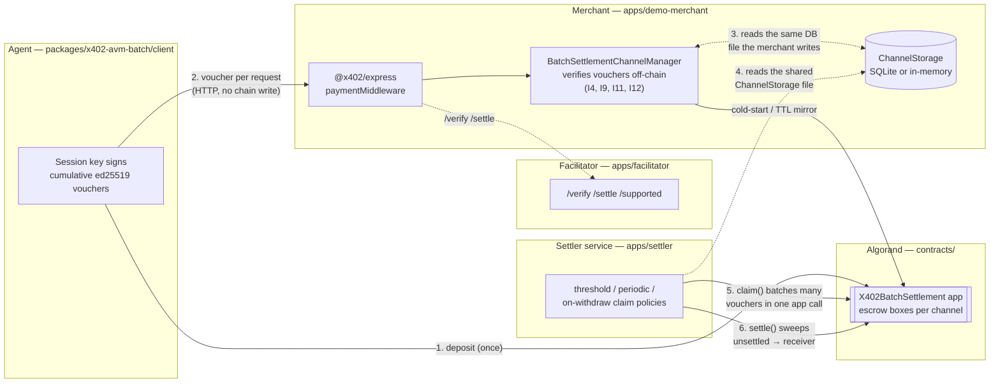
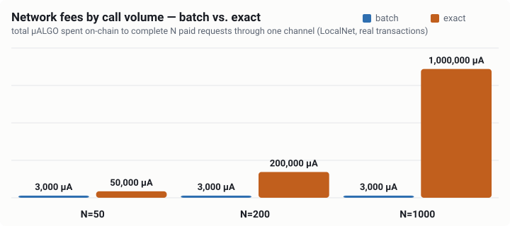
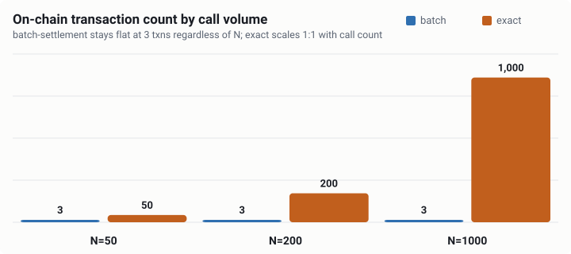
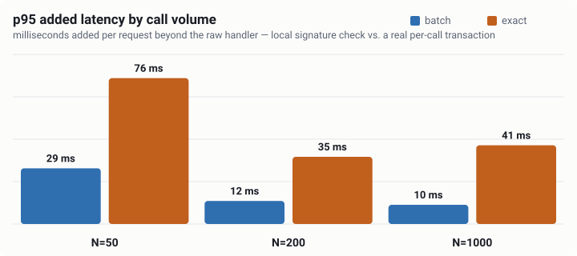

<!-- markdownlint-disable MD033 -->
# Turnstile

**x402 `batch-settlement` for the Algorand Virtual Machine (AVM).**

[](https://github.com/debojyoti10CC/turnstile)
[](https://github.com/x402-foundation/x402)
[](https://algorand.co)
[](https://dev.algorand.co/algokit/languages/python/overview/)

Turnstile is a complete, tested, real-transaction implementation of x402's `batch-settlement`
payment scheme for Algorand: an AI agent (or any HTTP client) deposits an ASA into an on-chain escrow
**once**, then pays for every subsequent API call with a cumulative ed25519 voucher that a merchant
server verifies **off-chain in microseconds** — no blockchain round-trip per request. Settlement, the
part that actually touches the chain, is deferred and batched: a settler claims many vouchers in one
app call and sweeps proceeds in one `settle()`, so the on-chain cost is fixed regardless of how many
requests funded it.

It ships as:

- a small, audited-style **Algorand Python smart contract** (escrow channels, ARC-56),
- a **plugin for the official [`@x402/*`](https://github.com/x402-foundation/x402) TypeScript SDK**
  (`SchemeNetworkClient` / `Server` / `Facilitator`), so it drops into `@x402/express` and `@x402/fetch`
  the same way `exact` does,
- a **draft protocol spec** ([`docs/spec/scheme_batch_settlement_avm.md`](docs/spec/scheme_batch_settlement_avm.md))
  written against this implementation and intended for upstreaming to x402-foundation/x402,
- and a full **demo stack** (facilitator, merchant, agent, standalone settler service, read-only
  dashboard) that runs end-to-end on LocalNet and TestNet.

> **Measured, not claimed.** At 1,000 calls through one channel, batch-settlement used **3 on-chain
> transactions and 3,000 µALGO in total network fees**, versus 1,000 transactions / 1,000,000 µALGO for
> a naive pay-per-call baseline — a **333× fee reduction**. See [Benchmarks](#benchmarks) for the chart,
> the raw numbers, and exactly how they were produced.

---

## Table of contents

- [Features](#features)
- [Why this exists](#why-this-exists)
- [Architecture](#architecture)
- [Repository layout](#repository-layout)
- [SDK packages](#sdk-packages)
- [Quickstart (LocalNet)](#quickstart-localnet)
- [Running the standalone settler](#running-the-standalone-settler)
- [TestNet](#testnet)
- [Testing & verification](#testing--verification)
- [Benchmarks](#benchmarks)
- [Security model](#security-model)
- [Limitations & open work](#limitations--open-work)
- [Protocol spec & references](#protocol-spec--references)
- [Tech stack](#tech-stack)
- [Contributing](#contributing)
- [Acknowledgments](#acknowledgments)
- [License](#license)

---

## Features

- **Escrow-channel micropayments on Algorand** — deposit once, pay per request with a signed voucher,
  settle in batches. No blockchain write on the hot path.
- **Drop-in `@x402/*` plugin** — implements `SchemeNetworkClient` / `Server` / `Facilitator`, the same
  interfaces the official `exact` scheme uses, so it works with unmodified `@x402/express` and
  `@x402/fetch`.
- **Dynamic and flat pricing**, both demonstrated end-to-end (`apps/demo-merchant`'s `/v1/infer` and
  `/v1/data` routes).
- **Real Algorand Python escrow contract** (ARC-56), not a mock — ed25519 signature verification,
  box-based per-channel storage, cooperative and unilateral exits.
- **Pluggable channel storage** — in-memory for quick demos, or `node:sqlite` (zero native build step)
  for state that survives a restart and can be shared with a separate settler process.
- **A standalone settler service** (`apps/settler`) with threshold / periodic / on-withdraw claim
  policies, independent of the merchant process.
- **A 24-attack adversary suite** run against real transactions, not a mock chain — every attack must
  be rejected, or the suite fails the build.
- **A read-only dashboard** (React/Vite) showing live channel state, the real benchmark, and the real
  adversary report — nothing on it is synthesized for display.
- **12 named, tested invariants** (I1–I12) covering balance safety, replay-proofness, role checks, and
  exit guarantees — see [`CLAUDE.md`](CLAUDE.md#9-invariants-acceptance-tests).

---

## Why this exists

[x402](https://github.com/x402-foundation/x402) is an open, chain-agnostic protocol for HTTP 402
("Payment Required") micropayments — the kind an AI agent needs when it's calling a paid API hundreds
or thousands of times per session. Its `batch-settlement` scheme (channel deposits + off-chain signed
vouchers + batched on-chain claims) already has reference bindings for EVM and SVM chains. Algorand had
none. Turnstile is that missing AVM binding, built to the same wire contract so an `@x402/fetch` client
or `@x402/express` server can use it as a drop-in `network` option alongside `exact`.

## Architecture



Every request after the first deposit is a local ed25519 signature check on both sides — not a
blockchain transaction. The merchant and the standalone settler process share one on-disk
`ChannelStorage` (SQLite, safe for concurrent processes via SQLite's own file locking), so the settler
can run as an independent long-lived service and still see exactly the vouchers the merchant accepted.

## Repository layout

```
turnstile/
├─ contracts/                    Algorand Python escrow contract (puyapy → ARC-56), offline + LocalNet tests
│  ├─ smart_contracts/x402_batch_settlement/   contract.py, generated ARC-56/TEAL/bytecode
│  ├─ tests/                     25 offline tests (algorand-python-testing emulator)
│  ├─ tests/localnet/            6 tests against real transactions on a live node
│  └─ scripts/deploy.py, deploy_testnet.py
├─ packages/
│  ├─ core/                      voucher & channel-id encoding, ed25519, Algorand address codec, wire types
│  ├─ escrow-client/             typed ARC-56 client + tx builders (deposit, claim, settle, refund, withdraw)
│  ├─ x402-avm-batch/            the x402 mechanism plugin: client / server / facilitator schemes
│  ├─ settler/                   claim/settle policy library (threshold, periodic, on-withdraw)
│  └─ adversary/                 24-attack suite run against real LocalNet, every attack must be rejected
├─ apps/
│  ├─ facilitator/                self-hosted batch-settlement facilitator (/verify /settle /supported)
│  ├─ demo-merchant/              Express + @x402/express — flat and dynamic-priced paid routes
│  ├─ demo-agent/                 @x402/fetch client loop + bench.ts
│  ├─ settler/                    standalone long-running settler process (wraps packages/settler)
│  └─ dashboard/                  React/Vite read-only view of channels, benchmarks, adversary report
└─ docs/
   ├─ spec/scheme_batch_settlement_avm.md   the protocol binding this repo implements
   ├─ reference/                             vendored upstream x402 specs (Apache-2.0)
   ├─ PROGRESS.md                            phase-by-phase build log with real measured results
   ├─ DECISIONS.md                           every non-obvious engineering decision and why
   ├─ spec-notes.md, RESOURCES.md, DEMO.md
```

## SDK packages

Each package is independently documented, versioned, and installable — use one directly in your own
project instead of running the whole demo stack:

| Package | Install | What it's for |
|---|---|---|
| [`@turnstile/core`](packages/core) | `npm i @turnstile/core` | Voucher/channel-id encoding, ed25519 signing, wire types — the shared vocabulary every other package builds on |
| [`@turnstile/escrow-client`](packages/escrow-client) | `npm i @turnstile/escrow-client` | Typed transaction builders for the escrow contract (deposit, claim, settle, refund, withdraw) |
| [`@turnstile/x402-avm-batch`](packages/x402-avm-batch) | `npm i @turnstile/x402-avm-batch` | The `@x402/core` plugin itself — client/server/facilitator schemes, drop-in with `@x402/express` and `@x402/fetch` |
| [`@turnstile/settler`](packages/settler) | `npm i @turnstile/settler` | Claim/settle policy engine; embed it in your own process, or run [`apps/settler`](apps/settler) as a ready-made standalone service |

## Quickstart (LocalNet)

Requires [Docker](https://www.docker.com/) (for LocalNet), [AlgoKit](https://dev.algorand.co/algokit/get-started/),
Python 3.12, and Node 22+.

```bash
pip install -r contracts/requirements.txt && pnpm install
algokit localnet start
pnpm contracts:build && pnpm contracts:test && pnpm contracts:localnet
python contracts/scripts/deploy.py   # prints app_id, asset_id, payer/receiver keys as JSON
pnpm -r build
```

Using the values `deploy.py` printed, start the facilitator and merchant (each in its own terminal),
then drive it with the demo agent:

```bash
X402_AVM_APP_ID=<app_id> RECEIVER_AUTHORIZER_ADDRESS=<receiver> \
  node apps/facilitator/dist/index.js

X402_AVM_APP_ID=<app_id> X402_AVM_ASSET_ID=<asset_id> RECEIVER_ADDRESS=<receiver> \
  FACILITATOR_URL=http://localhost:4402 CHANNEL_DB_PATH=./turnstile.sqlite \
  node apps/demo-merchant/dist/index.js

PAYER_ADDRESS=<payer> PAYER_PRIVATE_KEY=<payer_private_key> X402_AVM_APP_ID=<app_id> \
  X402_AVM_ASSET_ID=<asset_id> RECEIVER_ADDRESS=<receiver> \
  node apps/demo-agent/dist/index.js --mode batch --calls 10
```

`CHANNEL_DB_PATH` is optional — omit it and the merchant keeps channel state in memory only (fine for a
short-lived demo). Set it to persist state across restarts and to let the standalone settler
([below](#running-the-standalone-settler)) see the same channels from a separate process.

Watch it live: `pnpm -F @turnstile/dashboard dev` (reads the merchant's `/debug/*` endpoints).

## Running the standalone settler

`apps/settler` is a long-running process, separate from the merchant, that polls on-chain state and
claims/settles vouchers according to threshold / periodic / on-withdraw policies
([`packages/settler`](packages/settler)). It reads the **same** `CHANNEL_DB_PATH` SQLite file the
merchant writes to, so start the merchant with `CHANNEL_DB_PATH` set first:

```bash
CHANNEL_DB_PATH=./turnstile.sqlite \
  X402_AVM_APP_ID=<app_id> \
  RECEIVER_SENDER_ADDRESS=<receiver_or_receiverAuthorizer> \
  RECEIVER_SENDER_PRIVATE_KEY=<its_base64_secret_key> \
  POLL_INTERVAL_MS=30000 \
  CLAIM_THRESHOLD_ATOMIC=100000 \
  SETTLE_MIN_UNSETTLED_ATOMIC=1 \
  node apps/settler/dist/index.js
```

`RECEIVER_SENDER_PRIVATE_KEY` can be omitted on LocalNet if the address is one of the
KMD-tracked accounts `deploy.py` created; TestNet needs it explicitly. The process asserts
`pollIntervalMs × 3 < withdrawDelaySeconds × 1000` at startup — the whole point of the settler is to
beat a payer's withdraw window (invariant **I8**), so it refuses to start with a poll interval that
couldn't possibly do that.

## TestNet

```bash
pnpm deploy:testnet   # contracts/scripts/deploy_testnet.py — idempotent, safe to rerun
```

The script generates (or reuses) a deployer account, prints a funding address and instructions, and
exits with `needs_funding` until the [TestNet dispenser](https://bank.testnet.algorand.network/) has
funded it — it never logs or prints a mnemonic. Once funded, it deploys the escrow app and a mock
6-decimal ASA, and every app above accepts `NETWORK=testnet` to point at TestNet instead of LocalNet.
Verified live: app `771555042`, asset `771555032` on genesis `SGO1GKSzyE7IEPItTxCByw9x8FmnrCDe` (see
[`docs/PROGRESS.md`](docs/PROGRESS.md) for the recorded run — real deposit, 3 real paid calls, real
claim + settle).

## Testing & verification

Every layer has real, non-mocked tests. Nothing below is simulated data.

| Layer | Command | What it proves |
|---|---|---|
| Contract (offline) | `pnpm contracts:test` | 25 tests against the `algorand-python-testing` emulator, incl. fuzzed conservation and TS↔contract signature parity |
| Contract (real node) | `pnpm contracts:localnet` | 6 tests against real transactions on a live LocalNet node — fees, box MBR, opcode budget, real signatures |
| TypeScript packages | `pnpm -r test` | 42 tests across `core`, `escrow-client` (real on-chain lifecycle), `x402-avm-batch` (incl. SQLite storage + 50-concurrent-request I12), `settler` (incl. I8 on real LocalNet) |
| Attack suite | `pnpm adversary` | 24 attacks — 18 contract-level, 5 server-level, a 500-step fuzz — every one must be **rejected**; writes `packages/adversary/report.json` |
| Definition of done | `pnpm contracts:test && pnpm contracts:localnet && pnpm -r test && pnpm adversary && pnpm bench` | the project's own bar for "done", per [`CLAUDE.md`](CLAUDE.md) §10 |

All twelve invariants (I1–I12: balance bounds, monotonicity, conservation, replay-proofness, role
checks, exit guarantees, and more) have a named passing test — see the table in
[`CLAUDE.md`](CLAUDE.md#9-invariants-acceptance-tests) for the full list and where each is verified.

## Benchmarks

`pnpm bench` runs N ∈ {50, 200, 1000} against real LocalNet, comparing batch-settlement to a naive
one-real-transaction-per-call baseline — what any non-batched, settle-every-request scheme costs
on-chain (see [`docs/DECISIONS.md`](docs/DECISIONS.md) for why that's the fairer comparison than one
specific facilitator implementation). Charts and table below are generated directly from the most
recent real run — [`apps/demo-agent/bench.json`](apps/demo-agent/bench.json), also recorded in
[`docs/PROGRESS.md`](docs/PROGRESS.md) — via [`scripts/gen-bench-charts.mjs`](scripts/gen-bench-charts.mjs);
regenerate them with `node scripts/gen-bench-charts.mjs` any time `bench.json` changes.

<p align="center">
  
</p>

<p align="center">
  
</p>

<p align="center">
  
</p>

| N | mode | wall time | p50 / p95 added latency | on-chain txns | network fees |
|---|---|---|---|---|---|
| 50 | batch | 1,309 ms | 18 / 29 ms | 3 | 3,000 µALGO |
| 50 | exact | 1,893 ms | 36 / 76 ms | 50 | 50,000 µALGO |
| 200 | batch | 1,942 ms | 9 / 12 ms | 3 | 3,000 µALGO |
| 200 | exact | 4,396 ms | 22 / 35 ms | 200 | 200,000 µALGO |
| 1000 | batch | 8,214 ms | 8 / 10 ms | 3 | 3,000 µALGO |
| 1000 | exact | 22,149 ms | 17 / 41 ms | 1000 | 1,000,000 µALGO |

Batch-settlement's on-chain transaction count and fees stay **flat at 3 txns / 3,000 µALGO** regardless
of N (the one-time deposit group; claim/settle is deferred and amortized by the settler, not a
per-request cost) — a 333× fee reduction at N=1,000, excluding a one-time refundable ~121,000 µALGO
box-storage MBR paid once per channel, not per request. All six runs: 0 failures. Added latency is also
consistently lower for batch at every N — a local signature check beats waiting on a real transaction.

## Security model

- **Capital-backed, not reputation-based.** A client's exposure is capped at the ed25519 voucher
  ceiling (`maxClaimableAmount`) it actually signed, never the full deposit.
- **Hot/cold key separation.** `payerAuthorizer` (the session key signing a voucher on every request)
  can only authorize spend up to the deposit, or start a withdrawal that pays out to the cold `payer`
  key — it can never redirect funds anywhere else.
- **Replay-proof by construction.** Channel boxes are never deleted (deleting would reset
  `totalClaimed` and let old vouchers replay against a re-funded channel); `genesisHash` and `appId` are
  bound into both the channel id and every voucher, so cross-network and cross-deployment replay is
  impossible. Stale claim rows are no-ops, not reverts, so idempotent settler retries are always safe.
  Verified by **24/24** on real LocalNet — see [`packages/adversary/report.json`](packages/adversary/report.json).
- **Exit guarantee.** A payer can always recover unclaimed funds after `withdrawDelay` (15 min – 30
  days) without receiver cooperation. A receiver-side settler only needs to beat that window, not react
  instantly — invariant **I8**, verified against a real withdraw race in `packages/settler`'s LocalNet
  test and again live in this session with the standalone `apps/settler` service.
- **Box-reference limits, not opcode budget, cap batch size.** `claim()`'s row limit comes from
  Algorand's `MAX_APP_CALL_FOREIGN_REFERENCES = 8`, not the opcode-budget math the original design
  assumed — discovered and documented in [`docs/DECISIONS.md`](docs/DECISIONS.md).
- **`ed25519verify_bare`, not `ed25519verify`.** The AVM opcode that skips the `ProgData`/program-hash
  prefix, matching the voucher message format exactly (see [the spec](docs/spec/scheme_batch_settlement_avm.md)).

## Limitations & open work

- **No fee-payer sponsorship.** The spec allows a facilitator to co-sign a client's deposit group as a
  fee payer; this implementation always has the client submit its own fully-signed deposit with its own
  keys. A real wallet-driven agent (no direct chain access) would need this wired up.
- **`exact`-scheme benchmark comparison is a naive baseline** (one direct asset transfer per call), not
  `@x402/avm`'s real exact-scheme facilitator, which pins an alpha `algokit-utils` release this
  workspace deliberately avoids (see [`docs/DECISIONS.md`](docs/DECISIONS.md)). It still represents the
  real on-chain cost of any non-batched, pay-per-request scheme.
- **Dashboard is read-only and single-merchant.** It polls one merchant's `/debug/*` endpoints; there's
  no multi-merchant aggregation.
- **Escrow contract is TestNet-only.** MainNet deployment needs a reviewed `exact` fallback and explicit
  team sign-off per [`CLAUDE.md`](CLAUDE.md) §4 (P7) — deliberately not attempted here.
- **No pending-request TTL reservation system.** The EVM reference reserves a request's ceiling before
  running the handler to avoid holding a lock across arbitrary execution time; this implementation uses
  a simpler atomic commit-time check that preserves I9/I12 correctness (verified up to 50 concurrent
  requests on one channel) but hasn't been stress-tested at higher concurrency.

## Protocol spec & references

- **This binding:** [`docs/spec/scheme_batch_settlement_avm.md`](docs/spec/scheme_batch_settlement_avm.md) —
  finalized against the real implementation, meant to be proposed upstream.
- **x402 protocol home:** [github.com/x402-foundation/x402](https://github.com/x402-foundation/x402) ·
  generic [`batch-settlement` scheme](https://github.com/x402-foundation/x402) (vendored copy:
  [`docs/reference/scheme_batch_settlement.md`](docs/reference/scheme_batch_settlement.md)) ·
  [EVM binding](docs/reference/scheme_batch_settlement_evm.md) (primary template for this repo) ·
  [SVM binding](docs/reference/scheme_batch_settlement_svm.md) (closest analogue: ed25519 vouchers)
- **Full resource index** (specs, reference code paths, package versions, Algorand docs on opcodes,
  boxes/MBR, and resource limits): [`docs/RESOURCES.md`](docs/RESOURCES.md)
- **Algorand developer docs:** [dev.algorand.co](https://dev.algorand.co) ·
  [Algorand Python (Puya)](https://dev.algorand.co/algokit/languages/python/overview/) ·
  [Boxes & MBR](https://dev.algorand.co/concepts/smart-contracts/storage/box/) ·
  [Inner transactions & fee pooling](https://dev.algorand.co/concepts/smart-contracts/inner-txn/) ·
  [AlgoKit LocalNet](https://dev.algorand.co/algokit/cli/localnet/)
- **Upstream x402 vendor commit:** [`3c2ddfb9`](https://github.com/x402-foundation/x402/commit/3c2ddfb922893c91ef8f281b64f8045d1f5e0d75)
  (pinned in [`docs/reference/UPSTREAM_COMMIT.txt`](docs/reference/UPSTREAM_COMMIT.txt))

## Tech stack

| Layer | Choice |
|---|---|
| Contract | [Algorand Python (puyapy)](https://dev.algorand.co/algokit/languages/python/overview/), ARC-56 app spec |
| Chain SDK | [`algosdk`](https://www.npmjs.com/package/algosdk) v3, [`@algorandfoundation/algokit-utils`](https://www.npmjs.com/package/@algorandfoundation/algokit-utils) v9 |
| x402 SDK | [`@x402/core`](https://www.npmjs.com/package/@x402/core), `@x402/express`, `@x402/fetch` (2.25.0) |
| Crypto | [`@noble/ed25519`](https://www.npmjs.com/package/@noble/ed25519), [`@noble/hashes`](https://www.npmjs.com/package/@noble/hashes) |
| Storage | `ChannelStorage` interface — in-memory or `node:sqlite` (built into Node 22.5+, no native build step) |
| Tests | [vitest](https://vitest.dev) (TypeScript), [pytest](https://pytest.org) (contract, offline + LocalNet) |
| Tooling | pnpm workspaces, TypeScript strict, Node 22+, Python 3.12, [AlgoKit](https://dev.algorand.co/algokit/) + Docker for LocalNet |

## Contributing

Contributions, issues, and discussion are welcome — please open one on
[the repo](https://github.com/debojyoti10CC/turnstile/issues).

Before sending a change:

1. Read [`CLAUDE.md`](CLAUDE.md) — the full build brief: phases, invariants, contract facts, and known
   AVM pitfalls. It's the source of truth for how this project makes decisions.
2. Check [`docs/DECISIONS.md`](docs/DECISIONS.md) — every non-obvious engineering call and the
   reasoning behind it (version pins, scope cuts, bugs found and fixed, benchmark methodology). Don't
   re-decide something that was already decided for a documented reason; if you disagree with a past
   decision, say why and add a new entry rather than silently reverting it.
3. Keep the contract small and boring. Any change to
   `contracts/smart_contracts/x402_batch_settlement/contract.py` needs: updated offline tests
   (`pnpm contracts:test`), updated LocalNet tests (`pnpm contracts:localnet`), a regenerated ARC-56
   spec + typed client, regenerated golden vectors if the wire encoding changed
   (`packages/core/scripts/gen-vectors.ts`), and a `docs/DECISIONS.md` entry.
4. Run the full bar before opening a PR: `pnpm contracts:test && pnpm contracts:localnet && pnpm -r test
   && pnpm adversary` (LocalNet must be running: `algokit localnet start`). A new attack vector belongs
   in `packages/adversary`, not just a unit test — it should be demonstrably rejected on a real node.
5. Update [`docs/PROGRESS.md`](docs/PROGRESS.md) with what changed, what's next, and any risk — this
   repo's convention is real, dated log entries with measured results, never placeholder numbers.

No formal style guide beyond what's in `CLAUDE.md` §8 (TypeScript strict, no `any`, amounts as `bigint`
internally / decimal strings on the wire, pure functions in core, side effects at the edges).

## Acknowledgments

- [x402-foundation/x402](https://github.com/x402-foundation/x402) for the protocol and the EVM/SVM
  `batch-settlement` reference bindings this implementation mirrors.
- The [Algorand Foundation](https://algorand.co) for AlgoKit, `algokit-utils`, and the Puya compiler
  that make an Algorand Python contract this small and this fast to iterate on possible.

## License

No license file is currently published in this repository. All rights reserved unless the repository
owner adds one; open an issue on [the repo](https://github.com/debojyoti10CC/turnstile) if you need
clarification on reuse terms. Vendored upstream x402 specs under `docs/reference/` remain under their
original Apache-2.0 license from [x402-foundation/x402](https://github.com/x402-foundation/x402).
