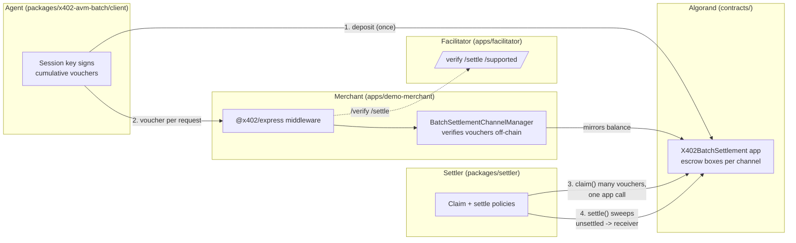

# Turnstile — x402 batch-settlement for Algorand

**The missing piece for pay-per-request AI agents on Algorand.** EVM and Solana already have x402's
`batch-settlement` scheme; Algorand didn't. Turnstile is a full, tested, deployed implementation of it:
an agent deposits USDC into an escrow once, pays every subsequent call with an off-chain ed25519
voucher verified in microseconds, and the merchant settles hundreds (or thousands) of calls in a
handful of on-chain transactions — not one per call. Ships as a plugin for the official `@x402/*` SDK,
plus a draft protocol spec meant to be upstreamed.

**Measured, not claimed:** at 1,000 calls through one channel, batch-settlement used **3 on-chain
transactions and 3,000 µALGO in network fees total**, versus 1,000 transactions / 1,000,000 µALGO for
a naive per-call baseline — see [Benchmarks](#benchmarks) below for the real numbers and how they were
produced.

## Architecture



Every request after the first deposit is a local signature check, not a blockchain transaction.
Settlement — the part that *does* touch the chain — is deferred and batched, and is a fixed cost
regardless of how many requests funded it.

## Quickstart (LocalNet)

```bash
pip install -r contracts/requirements.txt && pnpm install
algokit localnet start
pnpm contracts:build && pnpm contracts:test && pnpm contracts:localnet
python contracts/scripts/deploy.py   # prints app_id, asset_id, payer/receiver keys as JSON
pnpm -r build
```

Then, using the values from `deploy.py`'s JSON output, start the facilitator and merchant
(each in its own terminal), and drive it with the demo agent:

```bash
X402_AVM_APP_ID=<app_id> RECEIVER_AUTHORIZER_ADDRESS=<receiver> node apps/facilitator/dist/index.js
X402_AVM_APP_ID=<app_id> X402_AVM_ASSET_ID=<asset_id> RECEIVER_ADDRESS=<receiver> \
  FACILITATOR_URL=http://localhost:4402 node apps/demo-merchant/dist/index.js
PAYER_ADDRESS=<payer> PAYER_PRIVATE_KEY=<payer_private_key> X402_AVM_APP_ID=<app_id> \
  X402_AVM_ASSET_ID=<asset_id> RECEIVER_ADDRESS=<receiver> \
  node apps/demo-agent/dist/index.js --mode batch --calls 10
```

Watch it live: `pnpm -F @turnstile/dashboard dev` (reads the merchant's `/debug/*` endpoints).

To deploy and run the same flow on TestNet instead of LocalNet, see `contracts/scripts/deploy_testnet.py`
(`pnpm deploy:testnet`) and pass `NETWORK=testnet` to each app above.

## Benchmarks

`pnpm bench` runs N ∈ {50, 200, 1000} against real LocalNet, comparing batch-settlement to a naive
one-real-transaction-per-call baseline (what any non-batched, settle-every-request scheme costs
on-chain — see `docs/DECISIONS.md` for why that's the fairer comparison). Results from the most recent
run (`apps/demo-agent/bench.json`, also in `docs/PROGRESS.md`):

| N | mode | on-chain txns | network fees |
|---|---|---|---|
| 50 | batch | 3 | 3,000 µALGO |
| 50 | exact | 50 | 50,000 µALGO |
| 200 | batch | 3 | 3,000 µALGO |
| 200 | exact | 200 | 200,000 µALGO |
| 1000 | batch | 3 | 3,000 µALGO |
| 1000 | exact | 1000 | 1,000,000 µALGO |

Batch-settlement's transaction count and fees are flat regardless of N (claim/settle is deferred,
amortized accounting handled separately by `@turnstile/settler`, not a per-request cost) — a 333x fee
reduction at N=1000. Every number above is measured wall-clock/on-chain data, never assumed.

## Security model

- **Capital-backed, not reputation-based.** A client's risk is capped at the ed25519 voucher ceiling
  (`maxClaimableAmount`) it signed, never the full deposit.
- **Hot/cold key separation.** `payerAuthorizer` (the session key that signs vouchers every request) can
  only authorize spend up to the deposit or start a withdrawal that pays the cold `payer` key — it can
  never redirect funds elsewhere.
- **Replay-proof by construction.** Channel boxes are never deleted (deleting would reset `totalClaimed`
  and allow old vouchers to replay against a re-funded channel); cross-network and cross-deployment
  replay is prevented by binding `genesisHash` and `appId` into both the channel id and every voucher.
  Stale claim rows are no-ops, not reverts, so idempotent retries are always safe.
  Verified by 24/24 on real LocalNet in `packages/adversary` — see `packages/adversary/report.json`.
- **Exit guarantee.** A payer can always recover unclaimed funds after `withdrawDelay` (15 min–30 days)
  without receiver cooperation; a receiver-side settler only needs to beat that window, not act
  instantly (Invariant I8, verified against a real withdraw race in `packages/settler`'s LocalNet test).
- **Box-reference limits, not opcode budget, cap batch size.** `claim()`'s row limit comes from
  Algorand's `MAX_APP_CALL_FOREIGN_REFERENCES = 8`, not the opcode-budget math assumed in early design
  — see `docs/DECISIONS.md` for how that was discovered and verified.

## Limitations

- **No fee-payer sponsorship.** The spec allows a facilitator to co-sign a client's deposit as a fee
  payer; this reference implementation always has the client submit its own fully-signed deposit.
- **Settler is a library, not a standalone service.** `@turnstile/settler`'s claim/settle policies are
  tested directly (including the I8 withdraw-race invariant) but there's no long-running settler
  process shipped yet — running one against TestNet continuously is still open work.
- **`exact`-scheme comparison is a naive baseline**, not `@x402/avm`'s real exact-scheme facilitator
  (which pins an alpha `algokit-utils` this workspace deliberately avoids — see `docs/DECISIONS.md`).
  It still represents the real cost of any non-batched, pay-per-request scheme.
- **Dashboard is read-only and single-merchant.** It polls one merchant's in-memory channel storage
  directly; there's no multi-merchant aggregation or persistence.
- **Escrow contract is TestNet-only for now.** MainNet deployment needs a reviewed `exact` fallback and
  explicit team sign-off per `CLAUDE.md` §4 (P7).

## Map

- `PRD.md` — why and what · `CLAUDE.md` — build brief · `docs/spec/` — protocol binding (draft, verified
  against this implementation) · `docs/DECISIONS.md` — every design decision and why · `docs/PROGRESS.md`
  — phase-by-phase build log with real measured results
- `contracts/` — Algorand Python escrow (puyapy, ARC-56) · `packages/core` — voucher/channel primitives
  · `packages/escrow-client` — typed ARC-56 transaction builders · `packages/x402-avm-batch` — the x402
  mechanism plugin (client/server/facilitator) · `packages/settler` — claim/settle policies ·
  `packages/adversary` — attack suite (24/24 rejected on real LocalNet)
- `apps/facilitator`, `apps/demo-merchant`, `apps/demo-agent` — a working end-to-end demo ·
  `apps/dashboard` — read-only live view of channels, benchmarks, and the adversary report
- `docs/reference/` — vendored upstream x402 specs (Apache-2.0)
